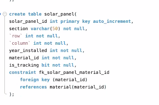
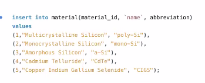
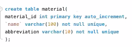
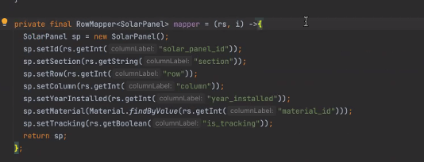

# JDBC

## How to set up JDBC and connect your app to a database

- Drop database if exists
- create database 
- use database

## using Solar Panel project

- create two tables, one for material and one for panels
- Material has material_id and name which is varchar not null and unique, as well as abbreviation varchar(10) amd not null and uq as well
- booleans are bit ( between 0 and 1) use a bit over boolean

- 
- 
- 
- 

# Webservers and Applications

# Breaking down a url

- first the protocol http vs https. https is more encrypted and secure
- prefix then subdomain, system called DNS domain name service, works like a directory, only job is to take a domain name, and translate it into an ip address

# Web app vs server

- a web application is a user-friendly thing to read, a GUI graphical user interface meant for humans to interact with
- while a server is not meant for human  interaction, and it's for computers to interact with
- the client is our browser, mobile apps internet of things IoT

# TomCat
- open based java web server

# Web Application
- our service, our code
  - like when we get this request, this is how we handle it and return a response

# REST
- we follow REST principles loosely
- 

